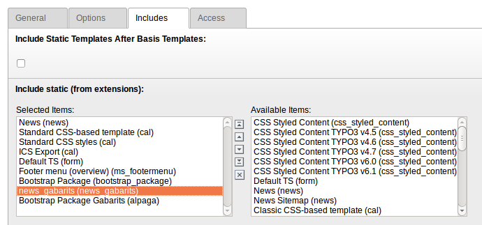

.. ==================================================
.. FOR YOUR INFORMATION
.. --------------------------------------------------
.. -*- coding: utf-8 -*- with BOM.

.. include:: ../Includes.txt

.. _admin-manual:

Manuel d'administration
=======================

Prérequis
---------

Inclure l'extension dans le gabarit du site.

Target group: **Administrators**

Installation
------------

Pour installer l'extension, vous devez la rendre disponible dans les extensions de la plateforme, pour cela, installer l'extension depuis le dépôt.

.. code-block:: shell
	:linenos:

	$ cd typo3conf/ext/
	$ git clone --recursive https://github.com/loicdeter/news_gabarits.git

Ensuite, activer l'extension dans le gestionnaire d'extensions

.. figure:: ../Images/AdministratorManual/extensionManager.png
	:width: 500px
	:alt: Extension Manager

	Extension Manager

	List of extensions within the Extension Manager also shortend as "EM"

FAQ
^^^

Que dois-je faire si je veux une mise à jour automatique de l'extension dans les versions supérieures ?

Il suffit de mettre un script sur le serveur qui permet une git pull avec les versions supérieures
